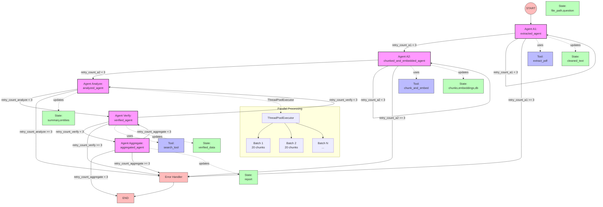
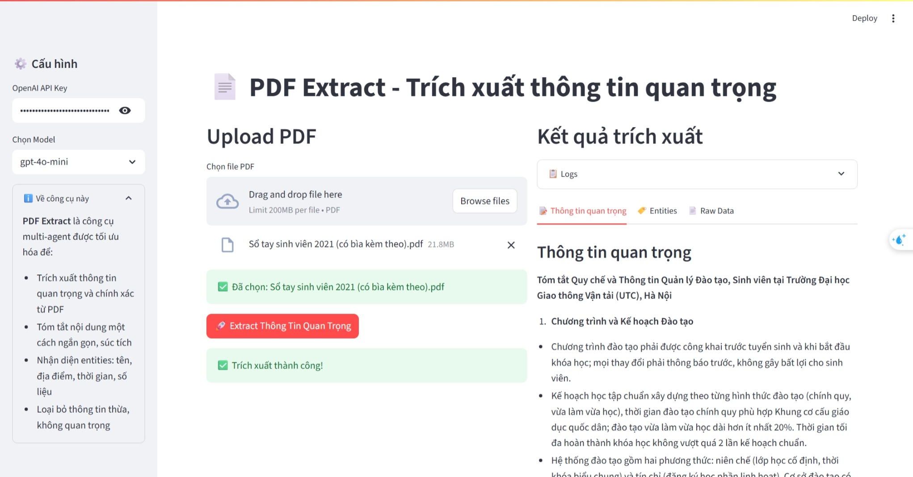

# PDF Extract - Multi-Agent PDF Information Extraction

PDF Extract là hệ thống multi-agent được thiết kế để trích xuất thông tin quan trọng, chính xác và ngắn gọn từ tài liệu PDF. Hệ thống sử dụng kiến trúc multi-agent kết hợp với large language models để phân tích và tổng hợp thông tin từ các tài liệu dài.

## Thư viện sử dụng

### Core PDF Processing
- **pdfplumber**: Trích xuất văn bản từ file PDF

### LangChain Ecosystem
- **langchain**: Framework xây dựng ứng dụng AI
- **langgraph**: Xây dựng luồng xử lý multi-agent
- **langchain-community**: Tích hợp với các model và tools
- **langchain-text-splitters**: Chia nhỏ văn bản

### LLM Integration
- **litellm**: Unified interface cho nhiều LLM providers
- **openai**: OpenAI API client (optional)

### Vector Database
- **faiss-cpu**: Vector database để lưu trữ và tìm kiếm embeddings
- **numpy**: Xử lý mảng số học

### Web Interface
- **streamlit**: Xây dựng giao diện người dùng

### Khác
- **pydantic**: Kiểm tra và xác thực dữ liệu
- **python-dotenv**: Quản lý biến môi trường
- **tiktoken**: Tính toán token cho OpenAI models

## Kiến trúc hệ thống



## Cấu trúc dự án

```
PDF_extract/
├── assets/                # Hình ảnh và tài nguyên
├── data/                  # Dữ liệu mẫu
├── indices/               # FAISS indices
├── modules/               # Các module chính
│   ├── agents.py          # Định nghĩa các agent
│   ├── graphs.py          # Xây dựng luồng xử lý
│   ├── routers.py         # Điều hướng giữa các agent
│   ├── states.py          # Định nghĩa trạng thái
│   └── tools.py           # Công cụ xử lý
├── outputs/               # Kết quả đầu ra
├── temp_files/            # File tạm thời
├── uploads/               # File PDF được tải lên
├── main.py                # Entry point cho CLI
├── streamlit_app.py       # Giao diện Streamlit
└── requirements.txt       # Dependencies
```

## Thành phần module

### 1. States (states.py)
Định nghĩa cấu trúc dữ liệu `AgentState` để lưu trữ và truyền thông tin giữa các agent:
- `file_path`: Đường dẫn file PDF
- `question`: Câu hỏi người dùng
- `cleaned_text`: Văn bản đã làm sạch
- `chunks`: Danh sách các đoạn văn bản
- `embeddings`: Danh sách vector embedding
- `db`: Đường dẫn FAISS index
- `summary`, `entities`, `verified_data`: Kết quả xử lý
- Các biến đếm retry cho mỗi agent
- Cấu hình model (api_key, model_name, embedding_model)
- Hỗ trợ đa dạng LLM providers thông qua LiteLLM

### 2. Tools (tools.py)
Cung cấp các công cụ xử lý:
- `extract_pdf`: Trích xuất văn bản từ PDF với xử lý lỗi
- `chunk_and_embed`: 
  - Chia nhỏ văn bản với RecursiveCharacterTextSplitter
  - Tạo embeddings với OpenAI API
  - Xử lý batch với rate limiting (20 chunks/batch)
  - Tạo và lưu FAISS index
- `search_tool`: Tìm kiếm thông tin với chiến lược multi-stage:
  - Broad Search với k mở rộng
  - Multi-Query Expansion
  - Context Expansion
  - Intelligent Ranking
  - Adaptive K Selection
  - Fallback Strategy

### 3. Agents (agents.py)
Định nghĩa các agent xử lý với tích hợp LiteLLM:
- `extracted_agent`: 
  - Trích xuất văn bản từ PDF
  - Xử lý retry tối đa 3 lần
  - Sử dụng LiteLLM để tương thích nhiều providers
- `chunked_and_embedded_agent`:
  - Phân đoạn và tạo embeddings
  - Điều chỉnh kích thước chunk tự động
  - Xử lý retry tối đa 3 lần
  - Hỗ trợ đa dạng embedding models
- `analyzed_agent`:
  - Phân tích nội dung với prompts tối ưu
  - Xử lý song song với ThreadPoolExecutor
  - Tách thành các batch 20 chunks
  - Tương thích với các LLM khác nhau qua LiteLLM
- `verified_agent`:
  - Xác minh kết quả với search_tool
  - Tối ưu query tìm kiếm
  - Xử lý retry và fallback
  - Linh hoạt chuyển đổi giữa các LLM providers
- `aggregated_agent`:
  - Tổng hợp kết quả cuối cùng
  - Format output theo FinalOutput schema
  - Tích hợp seamless với nhiều LLM

### 4. Điểm nổi bật trong xử lý

1. **Retry Logic Thông Minh**:
- Mỗi agent có counter riêng (retry_count_a1, retry_count_a2, etc.)
- Tối đa 3 lần retry cho mỗi agent
- Chuyển sang error handler khi vượt quá số lần retry

2. **Xử lý Batch và Rate Limiting**:
- Batch size 20 chunks cho embeddings
- Delay 1s giữa các batch
- Retry 30s cho rate limit errors

3. **Multi-Stage Search**:
- Broad Search với k mở rộng
- Query Expansion tự động
- Context Expansion thông minh
- Ranking dựa trên nhiều tiêu chí
- Fallback strategy cho kết quả chất lượng thấp

4. **Prompts Tối Ưu**:
- Prompts riêng cho summarize, extract và final_summarize
- Fallback prompts cho trường hợp đặc biệt
- Format JSON cho entities extraction
- Tương thích cross-model qua LiteLLM

5. **Parallel Processing**:
- ThreadPoolExecutor cho phân tích chunks
- Xử lý song song với batch size tối ưu
- Tổng hợp kết quả theo batch

6. **LLM Provider Integration**:
- Unified interface thông qua LiteLLM
- Hỗ trợ đa dạng providers: OpenAI, Azure, Anthropic, Claude...
- Dễ dàng chuyển đổi giữa các providers
- Xử lý rate limiting và retry tập trung
- Quản lý API keys linh hoạt

## Demo Streamlit

🔗 **Link Demo**: [https://atbmttcod-7gv7obijcmr68vsse3d6u6.streamlit.app/](https://atbmttcod-7gv7obijcmr68vsse3d6u6.streamlit.app/)



Giao diện Streamlit cung cấp:
- Upload file PDF
- Cấu hình API key và model (hỗ trợ nhiều providers)
- Hiển thị kết quả trích xuất theo tabs:
  - Thông tin quan trọng
  - Entities (tên, ngày tháng, địa điểm, số liệu)
  - Raw data
- Download kết quả dạng JSON
- Lựa chọn LLM provider

## Cách sử dụng

### Cài đặt
```bash
pip install -r requirements.txt
```

### Chạy ứng dụng Streamlit
```bash
streamlit run streamlit_app.py
```
