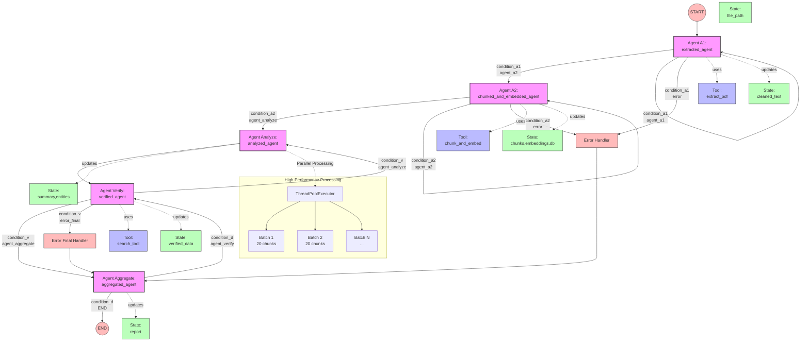

# PDF Extract - Multi-Agent PDF Information Extraction

PDF Extract là hệ thống multi-agent được thiết kế để trích xuất thông tin quan trọng, chính xác và ngắn gọn từ tài liệu PDF. Hệ thống sử dụng kiến trúc multi-agent kết hợp với large language models để phân tích và tổng hợp thông tin từ các tài liệu dài.

## Thư viện sử dụng

### Core PDF Processing
- **pdfplumber**: Trích xuất văn bản từ file PDF

### LangChain Ecosystem
- **langchain**: Framework xây dựng ứng dụng AI
- **langgraph**: Xây dựng luồng xử lý multi-agent
- **langchain-openai**: Tích hợp với OpenAI API
- **langchain-text-splitters**: Chia nhỏ văn bản

### Vector Database
- **faiss-cpu**: Vector database để lưu trữ và tìm kiếm embeddings
- **numpy**: Xử lý mảng số học

### Web Interface
- **streamlit**: Xây dựng giao diện người dùng

### Khác
- **pydantic**: Kiểm tra và xác thực dữ liệu
- **python-dotenv**: Quản lý biến môi trường
- **tiktoken**: Tính toán token cho OpenAI models

## Kiến trúc hệ thống



## Cấu trúc dự án

```
PDF_extract/
├── assets/                # Hình ảnh và tài nguyên
├── data/                  # Dữ liệu mẫu
├── indices/               # FAISS indices
├── modules/               # Các module chính
│   ├── agents.py          # Định nghĩa các agent
│   ├── graphs.py          # Xây dựng luồng xử lý
│   ├── routers.py         # Điều hướng giữa các agent
│   ├── states.py          # Định nghĩa trạng thái
│   └── tools.py           # Công cụ xử lý
├── outputs/               # Kết quả đầu ra
├── temp_files/            # File tạm thời
├── uploads/               # File PDF được tải lên
├── main.py                # Entry point cho CLI
├── streamlit_app.py       # Giao diện Streamlit
└── requirements.txt       # Dependencies
```

## Thành phần module

### 1. States (states.py)
Định nghĩa cấu trúc dữ liệu `AgentState` để lưu trữ và truyền thông tin giữa các agent:
- `file_path`: Đường dẫn file PDF
- `cleaned_text`: Văn bản đã làm sạch
- `chunks`: Danh sách các đoạn văn bản
- `embeddings`: Danh sách vector embedding
- `db`: Đường dẫn FAISS index
- `summary`, `entities`, `verified_data`: Kết quả xử lý

### 2. Tools (tools.py)
Cung cấp các công cụ xử lý:
- `extract_pdf`: Trích xuất văn bản từ PDF
- `chunk_and_embed`: Chia nhỏ văn bản và tạo embeddings
- `search_tool`: Tìm kiếm thông tin liên quan

### 3. Agents (agents.py)
Định nghĩa các agent xử lý:
- `extracted_agent`: Trích xuất văn bản từ PDF
- `chunked_and_embedded_agent`: Chia nhỏ và tạo embeddings
- `analyzed_agent`: Phân tích nội dung
- `verified_agent`: Xác minh kết quả
- `aggregated_agent`: Tổng hợp kết quả cuối cùng

### 4. Graphs (graphs.py)
Xây dựng luồng xử lý multi-agent sử dụng LangGraph:
- Định nghĩa các node (agent)
- Thiết lập các cạnh và điều kiện chuyển tiếp
- Xử lý lỗi và retry logic

### 5. Routers (routers.py)
Điều hướng luồng xử lý dựa trên kết quả và trạng thái:
- `condition_a1`, `condition_a2`: Điều kiện chuyển tiếp giữa các agent
- `condition_d`, `condition_v`: Xử lý lỗi và retry

## Điểm nổi bật trong xử lý multi-agent

### 1. Chunking và Embedding thông minh
- Chia văn bản thành các đoạn nhỏ (chunks) với kích thước tối ưu 2000 ký tự
- Xử lý overlap giữa các chunk để đảm bảo ngữ cảnh
- Tự động điều chỉnh kích thước chunk nếu cần

### 2. Xử lý song song (Parallel Processing)
- Sử dụng ThreadPoolExecutor để xử lý song song các chunk
- Tối ưu hóa với batch size 20 chunks mỗi batch
- Xử lý rate limiting với delay giữa các batch

### 3. Prompt Engineering tối ưu
- Prompt được thiết kế để trích xuất thông tin quan trọng, chính xác và ngắn gọn
- Tập trung vào dữ kiện chính, tên, địa điểm, thời gian và số liệu
- Loại bỏ thông tin trùng lặp và không quan trọng

### 4. Xử lý lỗi và retry
- Cơ chế retry thông minh cho từng agent
- Xử lý các lỗi API và rate limiting
- Lưu trữ trạng thái trung gian để khôi phục khi cần

### 5. Tổng hợp kết quả theo batch
- Chia summaries thành các batch lớn hơn để tận dụng token limit
- Tổng hợp thành các entities có cấu trúc: tên, ngày tháng, địa điểm, số liệu
- Tạo tóm tắt cuối cùng ngắn gọn và súc tích

## Demo Streamlit

🔗 **Link Demo**: [https://atbmttcod-7gv7obijcmr68vsse3d6u6.streamlit.app/](https://atbmttcod-7gv7obijcmr68vsse3d6u6.streamlit.app/)


Giao diện Streamlit cung cấp:
- Upload file PDF
- Cấu hình API key và model
- Hiển thị kết quả trích xuất theo tabs:
  - Thông tin quan trọng
  - Entities (tên, ngày tháng, địa điểm, số liệu)
  - Raw data
- Download kết quả dạng JSON

## Cách sử dụng

### Cài đặt
```bash
pip install -r requirements.txt
```

### Chạy ứng dụng Streamlit
```bash
streamlit run streamlit_app.py
```
