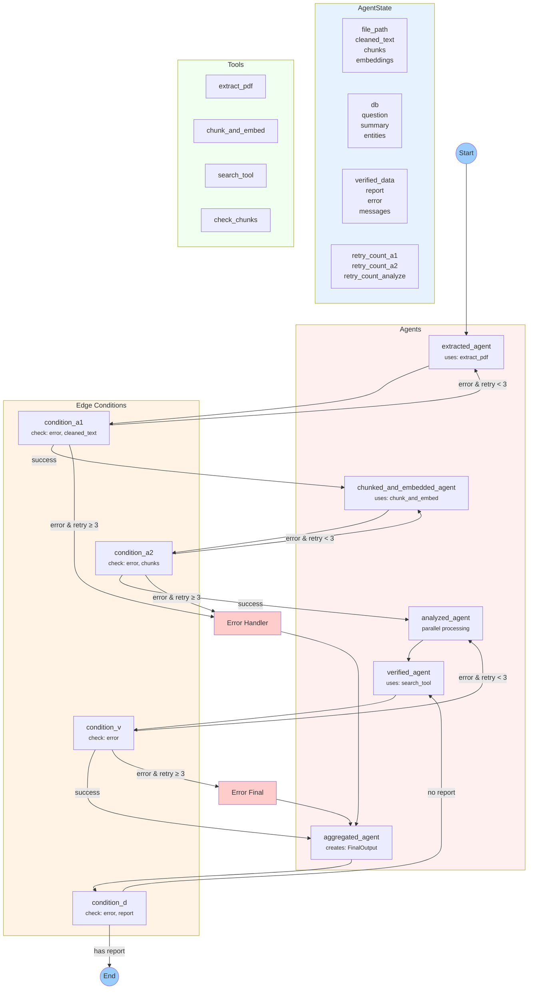

# Hệ Thống Multi-Agent Trích Xuất PDF

Hệ thống sử dụng kiến trúc Multi-Agent để trích xuất và phân tích thông tin từ tài liệu PDF, với trọng tâm là xử lý song song và tối ưu hiệu suất thông qua việc phân chia công việc cho các agent chuyên biệt.

## Thư Viện Sử Dụng

Dựa trên imports trong code:
- `langgraph`: Xây dựng StateGraph cho luồng xử lý multi-agent
- `langchain_openai`: Tương tác với OpenAI API (ChatOpenAI)
- `pydantic`: Định nghĩa model cho output
- `python-dotenv`: Quản lý biến môi trường (OPENAI_API_KEY, MODEL_NAME)

## Kiến Trúc Hệ Thống Multi-Agent

### Các Thành Phần Chính

1. **State Management (AgentState)**
   - Quản lý trạng thái của toàn bộ quy trình
   - Lưu trữ dữ liệu trung gian và kết quả
   - Theo dõi số lần retry của mỗi agent
   - Chứa thông tin về lỗi và messages giữa các agents

2. **Tools**
   - `extract_pdf`: Trích xuất nội dung từ file PDF
   - `chunk_and_embed`: Phân đoạn văn bản và tạo embeddings
   - `search_tool`: Tìm kiếm thông tin liên quan trong FAISS index
   - `check_chunks`: Kiểm tra tính hợp lệ của các chunks

3. **Agents**
   - `extracted_agent`: Xử lý trích xuất PDF
   - `chunked_and_embedded_agent`: Quản lý phân đoạn và embeddings
   - `analyzed_agent`: Phân tích nội dung (xử lý song song)
   - `verified_agent`: Xác minh kết quả
   - `aggregated_agent`: Tổng hợp kết quả cuối cùng

4. **Routers**
   - `condition_a1`: Kiểm tra kết quả trích xuất PDF
   - `condition_a2`: Kiểm tra tính hợp lệ của chunks
   - `condition_v`: Kiểm tra kết quả verify
   - `condition_d`: Kiểm tra báo cáo cuối cùng

### Luồng Xử Lý



### Quy Trình Xử Lý

1. **Khởi tạo**
   - Bắt đầu với file PDF path và câu hỏi
   - Khởi tạo AgentState với các giá trị mặc định

2. **Trích xuất và Phân đoạn**
   - Agent A1 trích xuất nội dung PDF
   - Agent A2 phân đoạn và tạo embeddings
   - Mỗi agent có 3 lần retry nếu gặp lỗi

3. **Phân tích và Xác minh**
   - Agent Analyze xử lý song song các chunks
   - Agent Verify kiểm tra kết quả với search_tool
   - Có thể quay lại Analyze nếu verify thất bại

4. **Tổng hợp Kết quả**
   - Agent Aggregate tạo FinalOutput
   - Bao gồm answer, summary, entities và verified_data

5. **Xử lý Lỗi**
   - Error Handler cho các lỗi thông thường
   - Error Final Handler cho lỗi nghiêm trọng
   - Tất cả đều chuyển đến Aggregate để tổng hợp

## Các Module Trong Hệ Thống

### 1. `modules/agents.py`
Định nghĩa các agents và luồng xử lý:

**Các Agent Chính:**
- `extracted_agent`: Trích xuất nội dung PDF
- `chunked_and_embedded_agent`: Phân đoạn và tạo embeddings
- `analyzed_agent`: 
  - Xử lý song song với batch_size=20
  - ThreadPoolExecutor(max_workers=15)
  - Delay 0.2s giữa các batches
  - Lưu kết quả trung gian vào analyze_intermediate.json
- `verified_agent`: Xác minh kết quả với search_tool
- `aggregated_agent`: Tạo output theo FinalOutput model

**Xử lý Lỗi:**
- Mỗi agent có 3 lần retry
- Các error handlers: error_handler và error_final_handler
- Logging với timestamp và emoji

### 2. `modules/states.py`
Định nghĩa trạng thái của hệ thống:
```python
class AgentState(TypedDict):
    file_path: str                      # Đường dẫn PDF
    cleaned_text: Optional[str]         # Text sau xử lý
    chunks: List[str]                   # Các đoạn văn bản
    embeddings: List[List[float]]       # Vector embeddings
    db: str                            # FAISS index
    question: str                       # Câu hỏi
    summary: Optional[str]              # Tóm tắt
    entities: Optional[Dict[str, Any]]  # Entities
    verified_data: Optional[Dict[str, Any]]  # Data đã verify
    report: Optional[str]               # JSON output
    error: Optional[str]                # Lỗi
    messages: List[Dict[str, str]]      # Messages giữa agents
    retry_count_a1: int                 # Số lần retry A1
    retry_count_a2: int                 # Số lần retry A2
    retry_count_analyze: int            # Số lần retry Analyze
```

### 3. Output Format
```python
class FinalOutput(BaseModel):
    answer: str = Field(description="Câu trả lời cho câu hỏi")
    summary: str = Field(description="Tóm tắt nội dung")
    entities: Dict[str, Any] = Field(description="Entities trích xuất")
    verified_data: Dict[str, Any] = Field(description="Dữ liệu đã xác minh")
```

## Cấu Trúc Project
```
PDF_extract/
  ├── data/              # Thư mục PDF
  ├── main.py           # Entry point
  ├── modules/
  │   ├── __init__.py
  │   ├── agents.py     # Các agents
  │   ├── states.py     # AgentState
  │   └── tools.py      # Công cụ hỗ trợ
  └── requirements.txt  # Dependencies
```

## Hiệu Suất Xử Lý

### Tối ưu song song:
- Batch size: 20 chunks/lần
- Workers: 15 threads đồng thời
- Delay: 0.2s giữa các batch
- Token limit: 150k/chunk

### Rate Limits:
- 200k tokens/phút
- 500 requests/phút
- Xử lý chunk thông minh

### Xử lý lỗi:
- Retry tự động (3 lần/agent)
- Logging chi tiết
- Lưu trạng thái trung gian
- Fallback strategies

## Thời Gian Xử Lý
- Trích xuất PDF: ~13s
- Phân đoạn & embedding: ~13s
- Phân tích nội dung: ~3-4s
- Tổng thời gian: 30-35s

## Cài Đặt

1. Cài đặt dependencies:
```bash
pip install -r requirements.txt
```

2. Thiết lập môi trường:
```bash
OPENAI_API_KEY=your_api_key
MODEL_NAME=gpt-3.5-turbo
```

3. Chuẩn bị file PDF trong thư mục data

## Performance Metrics

- Total processing time: 30-35s (improved from 15-20s)
- PDF extraction: ~13s
- Chunking & embeddings: ~13s
- Content analysis: ~3-4s
- Verification & aggregation: ~1-2s

## State Management

The system uses a TypedDict-based state management system (`AgentState`) to track:
- File processing status
- Extracted text and chunks
- Embeddings and search indices
- Analysis results and entities
- Error states and retry counts
- Inter-agent messages

## Error Handling

- Automatic retries (3 attempts per agent)
- Detailed logging with timestamps
- Error classification and recovery
- State preservation during retries
- Graceful degradation options

## Output Format

The final output is a JSON structure containing:
- Answer to the specific question
- Document summary
- Extracted entities (names, dates, locations, numbers)
- Verified data points
- Processing metadata

## Contributing

1. Fork the repository
2. Create your feature branch
3. Commit your changes
4. Push to the branch
5. Create a Pull Request

## License

This project is licensed under the MIT License - see the LICENSE file for details. 